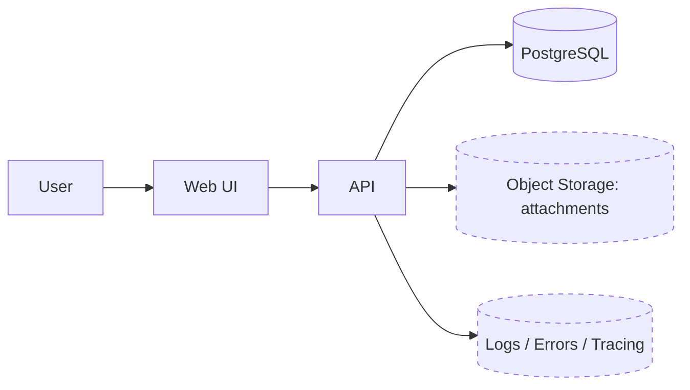

# Arkkitehtuurimalli: Multi-tenant SaaS (MVP → v2)

## 1) Tavoite
Rakennetaan multi-tenant SaaS, jossa on:
- **Tenant-eristys** (`tenant_id` kaikessa domain-datassa)
- **RBAC** (tenant-kohtaiset roolit + permissionit) ja **aikarajatut roolit** (`valid_from/to`)
- **Domain**: Companies + Projects
- **Hybridi data-malli**: ydintiedot normalisoituna, muuttuvat kentät JSONB:ssä
- **Audit-log** kriittisille muutoksille

## 2) Päätökset (high-level)
- **ADR-001 Hybridi data-malli**: Core = normalisoitu, “epävarma/muuttuva” = JSONB.
- **ADR-002 Tenant_id kaikkialle**: kaikki domain-taulut sisältävät `tenant_id`.
- **ADR-003 RBAC + aikarajat**: roolit voidaan myöntää määräajaksi.
- **ADR-004 Audit-log**: jäljitettävyys vähintään create/update/delete + roolimuutokset.

Katso tarkemmat perustelut: `docs/adr/`.

## 3) C4-henkinen kokonaiskuva

### L1: Konteksti

### L2: Sovelluspalikat
- **Web UI**: Next.js (tai vastaava)
- **API**: Next.js API routes / server actions (tai erillinen Node API)
- **DB**: PostgreSQL (migraatiot SQL/ORM)
- (opt) **Liitteet**: object storage (S3-yhteensopiva)
- (opt) **Observability**: error tracking + request-log + audit-log

## 4) Domain ja data-malli

### 4.1 Entiteetit
- Tenancy: `tenants`, `users`, `memberships`
- RBAC: `roles`, `permissions`, `role_permissions`, `role_assignments (valid_from/to)`
- Domain: `companies`, `projects`
- Audit: `audit_log`
- (opt) `attachments`

### 4.2 Hybridi data-malli: normalisoitu + JSONB
**Normalisoidaan heti:**
- tunnisteet (UUID)
- suhteet (FK)
- listaus-/hakukentät (name, status, created_at)
- raportoitavat perusulottuvuudet (tenant, company, project)

**JSONB (MVP-nopeus):**
- `companies.company_details`
- `projects.project_details`

**JSONB-sääntö:**
- JSONB on ok, kun rakenne elää ja kenttä ei ole heti raportoinnin/suodatuksen ytimessä.
- Kun samaa avainta käytetään usein suodatuksessa/järjestyksessä/raportoinnissa → nosta v2:ssa sarakkeeksi/tauluksi (katso `docs/06-migration-jsonb-to-normalized.md`).

## 5) Tenant-eristys (security baseline)
**MVP**: eristys sovelluskerroksessa
- Kaikki domain-queryt sisältävät `WHERE tenant_id = :tenantId`.
- Kaikki write-operaatiot vaativat: (a) membership tenanttiin + (b) permission.

**v2**: PostgreSQL Row Level Security (RLS)
- Ota RLS käyttöön domain-tauluissa (companies, projects, audit_log…).
- Aseta request-kohtainen `app.tenant_id` (esim. DB-session config) ja tee policy sen pohjalta.
- RLS toimii “turvaverkkona” sovellusvirheille.

Tarkemmat ohjeet + esimerkkipolitiikat: `docs/05-tenant-isolation.md`.

## 6) RBAC (roles + permissions)
- Permission-avaimet esim.:
  - `company.read`, `company.write`
  - `project.read`, `project.write`
  - `rbac.manage`
  - `audit.read` (jos audit näkyy UI:ssa)
- Käyttäjän oikeudet = union(permissions) niistä rooleista, jotka ovat voimassa nyt:
  - `valid_from` on null tai <= now
  - `valid_to` on null tai >= now

Tarkempi malli: `docs/04-rbac.md`.

## 7) API minimi (MVP)
Minimi-API: katso `docs/03-api-min-spec.md`.
Pakolliset kokonaisuudet:
- `GET /me` (user + current tenant + permissions)
- CRUD:
  - companies: list/create/update
  - projects: list/create/update
- RBAC hallinta (admin):
  - roolien listaus
  - role assignmentit (create/delete)
- Audit kirjoitetaan kriittisistä muutoksista.

## 8) MVP → v2: JSONB → normalisoitu (hallittu migraatio)
Polku:
1) Lisää uusi sarake/taulu
2) Backfill JSONB → uusi rakenne
3) Luku: uusi ensisijainen, fallback JSONB
4) Kirjoitus: siirtymävaiheessa molempiin (tai vain uuteen)
5) Poista vanha polku / pidä legacy-metana

Katso yksityiskohtainen checklist: `docs/06-migration-jsonb-to-normalized.md`.

## 9) Ei-tavoitteet MVP:ssä
- Laaja BI/analytiikka
- Monimutkaiset workflowt ja automaatiot
- Täysi event sourcing / CQRS (voi tulla myöhemmin, jos tarve)
