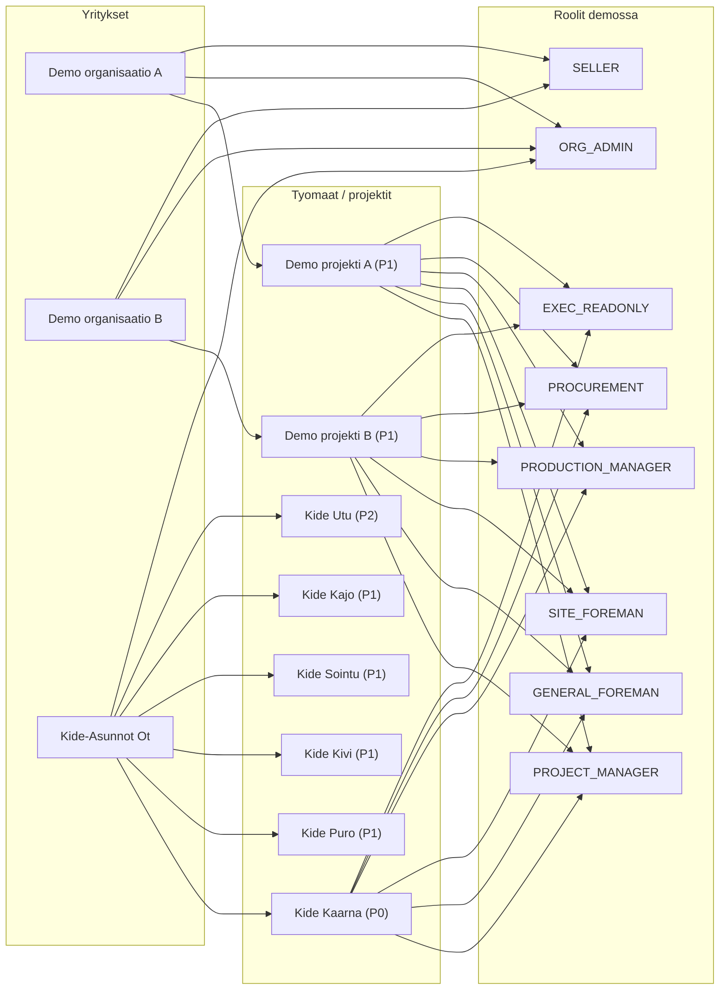
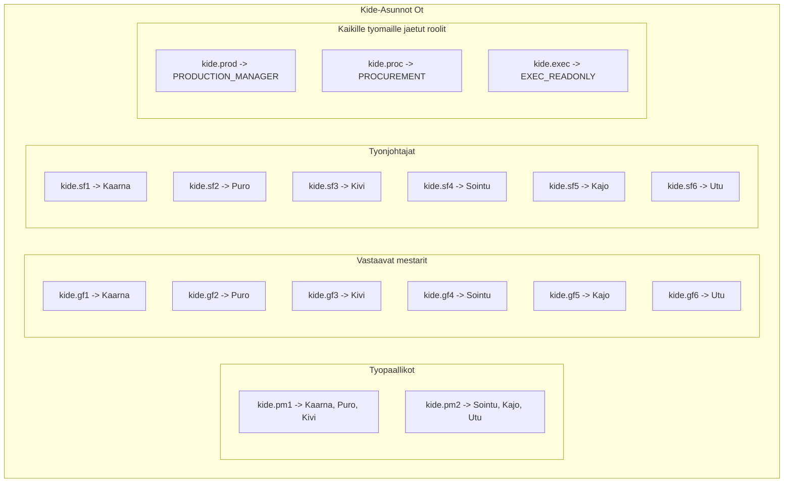
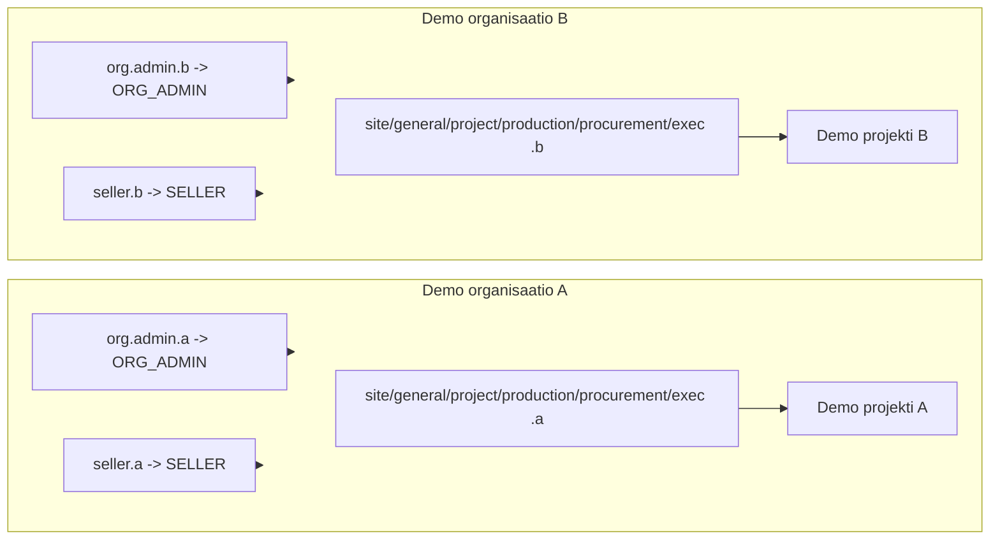

# Demo-kaaviot: yritykset, tyomaat ja roolit

Paivitetty: 2026-02-08
Lahde: `data/samples/demo_catalog.v1.json` (kanoninen manifesti)

## Kaavio 1: Demo-rakenne

## Kaavio 2: Kide-ympariston roolijako tyomailla

## Kaavio 3: Demo-organisaatioiden roolimalli (A/B)

## Mita muuttui

- Lisatty yksi ladattava kaaviodokumentti, jossa on 3 kaaviota.
- Kaaviot kuvaavat demossa olevat yritykset, tyomaat ja roolit.

## Miksi

- Tarvitaan yksi helposti jaettava dokumentti myynti- ja hyvaksyntakierroksille.

## Miten testataan (manuaali)

1) Avaa `docs/demo/DEMO_KAAVIOT.md`.
2) Varmista, etta Mermaid-kaaviot renderoituvat editorissa.
3) Vertaa sisaltoa tiedostoon `data/samples/demo_catalog.v1.json`.
smoke 2026-02-08
