# RUNBOOK – Data-fix (versionoidut skriptit) – Ennustus (MVP)

Päivitetty: 2026-01-02

Tässä runbookissa data-korjaukset tehdään **vain versionoiduilla skripteillä** (migrations/backfill/verify).  
**Manuaalinen DB-edit tuotannossa ei ole sallittu.**

---

## 1) Milloin tätä käytetään
- Raporteissa/laskennassa on virhe, jonka syy on datassa tai DB-näkymissä
- Import on tuonut väärää kohdistusta ja vaatii backfillin
- Tarvitaan constraint/view-fix tai datan normalisointi

Jos kyse on akuutista häiriöstä: tee samalla incident-tiketti (SEV) ja banneri.

---

## 2) Periaatteet
- Kaikki muutokset ovat:
  - **toistettavia**
  - **auditoitavia**
  - **rollback-ystävällisiä**
- Tuotannossa aina:
  - **DB backup**
  - **migrations**
  - **verify**
  - smoke + raporttidiff

---

## 3) Nappipolku (toimittaja)

### A) Ticket + rajaus
1. **[Create data-fix ticket]** (ulkoinen)
2. Kirjaa:
   - mitä on väärin
   - miltä ajalta
   - mitä sen pitäisi olla (odotusarvo)
   - vaikutus (tenant/projekti)

### B) Toista stagingissa
3. **[Reproduce in staging]**
   - fixturet tai anonymisoitu otos
   - varmista “ennen”-tila

### C) Toteuta korjaus
4. Valitse tyyppi:
   - **Migration** (schema/view/constraint)
   - **Backfill** (data update)
   - **Verify** (invariant checks)
5. **[Implement]** repon sisään
6. Aja testit:
   - unit
   - integration (DB+migrations+views)
   - e2e (jos muuttaa polkuja)

### D) Aja stagingissa
7. **Staging DB backup**
8. **Run migrations + backfill + verify**
9. **Report diff** (before/after)
10. **UAT/Approver** (go/no-go)

### E) Aja tuotannossa (gated)
11. **Prod DB backup**
12. (valinn.) banneri “maintenance”
13. **Run migrations + backfill + verify**
14. Smoke + raporttien täsmäytys
15. Poista banneri
16. Sulje tiketti + linkit PR/release/logit

---

## 4) Data-fix detail -kaavio

```mermaid
flowchart LR

subgraph T["Ticket (External)"]
  T0["Create data-fix ticket"]
  T1["Define scope + expected result"]
end

subgraph DEV["Dev/DB"]
  D0["Reproduce in staging (fixtures/anonymized sample)"]
  D1["Implement: migration/backfill/verify"]
  D2["Tests: unit + integration + e2e (if needed)"]
end

subgraph STG["Staging"]
  STG0["DB backup (staging)"]
  STG1["Run migrations/backfill"]
  STG2["Run verify"]
  STG3["Report diff + smoke"]
end

subgraph APP["Approver"]
  A0["Go/No-Go"]
end

subgraph PROD["Production"]
  P0["DB backup (prod)"]
  P1["Run migrations/backfill"]
  P2["Run verify (gate)"]
  P3["Smoke + monitoring"]
end

T0 --> T1 --> D0 --> D1 --> D2 --> STG0 --> STG1 --> STG2 --> STG3 --> A0
A0 --> P0 --> P1 --> P2 --> P3
```

## Mitä muuttui
- Päivitetty päivämäärä 2026-01-02.
- Lisätty muutososiot dokumentin loppuun.
- Mermaidiin vaihdettiin Staging-solmujen tunnukset muotoon `STG0–STG3` (ei `S0/S1`).

## Miksi
- Päivämäärä pidetään linjassa päätöslokin kanssa.
- Dokumentaatiokäytäntö: muutokset kirjataan näkyvästi.
- Vältetään sekaannus SaaS-vaiheiden `S-1/S0/S1` kanssa.

## Miten testataan (manuaali)
- Varmista, että päivämäärä vastaa päätöslokia.
- Avaa dokumentti ja varmista, että osiot ovat mukana.
- Avaa mermaid-kaavio ja varmista, että Staging-solmut ovat `STG0–STG3`.
