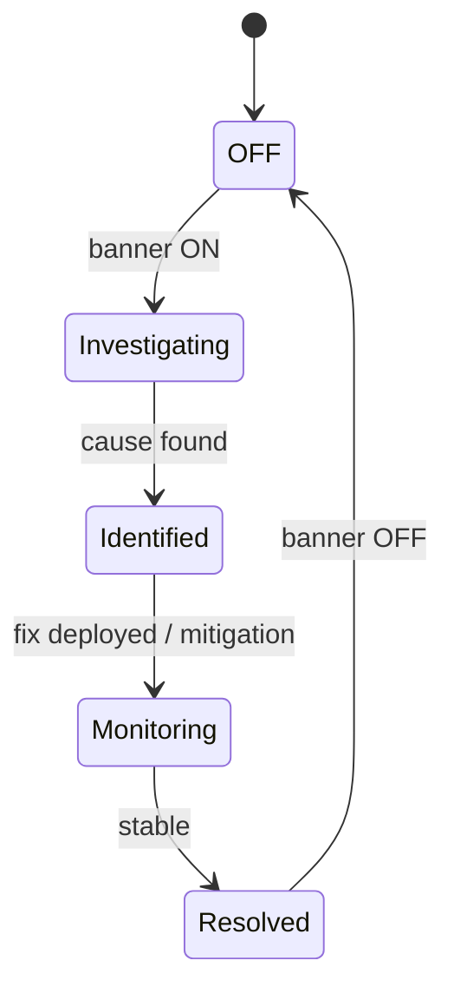

# RUNBOOK – Incident (SEV1–SEV3) – Ennustus (MVP)

Päivitetty: 2026-01-02

Tässä runbookissa incidentit hoidetaan **ulkoisessa tikettijärjestelmässä** (Jira/Zendesk tms.), ja sovelluksessa käytetään **häiriöbanneria** (in-app banner) asiakasviestintään.  
**Hotfix-kaista** on sallittu, mutta aina **Staging + DB backup + migrations/verify** -portilla.

---

## 1) Tavoite ja rajaus

### Tavoite
- Reagoida nopeasti, vähentää haittaa (mitigate), korjata pysyvästi (resolve) ja oppia (postmortem).
- Pitää asiakasviestintä selkeänä (banneri) ja audit/jäljitettävyys kunnossa (tiketti + release).

### Ei tässä runbookissa
- Asiakasprojektin sisäiset “kuukausikorjaukset” (tuotantojohtaja → yksikön johtajan hyväksyntä)  
  → nämä ovat **tuoteprosessia**, eivät “incident”.
- Data-korjaukset tehdään omalla runbookilla  
  → `docs/runbooks/data-fix.md`

---

## 2) Roolit ja vastuut (minimi)

| Rooli | Vastuu |
|---|---|
| **Support / On-call** | Triage, SEV-luokka, tiketin sisältö, päivitysrytmi, koordinaatio |
| **Superadmin (App)** | Häiriöbanneri ON/OFF + päivitykset |
| **Dev / Tech lead** | Syyanalyysi, mitigointi, korjaus (PR), osallistuu viestintään |
| **Hyväksyjä (Approver)** | Go/No-Go Staging → Prod (nimetty henkilö) |

---

## 3) SEV-luokitus (suositus)

> Jos epäröit: valitse “vakavampi” ja laske myöhemmin.

| SEV | Milloin | Esimerkkejä | Päivitysrytmi | Postmortem |
|---|---|---|---|---|
| **SEV1** | Laaja tuotantokatko tai merkittävä data-/raportointiriski | Login poikki, raportit eivät lähde, import pahasti rikki, väärä data monella | 30–60 min | **Pakollinen** |
| **SEV2** | Merkittävä häiriö, workaround löytyy | raportit hidastuvat, yksi toiminto rikki | 4 h | Suositus |
| **SEV3** | Pieni häiriö / rajoitettu vaikutus | UI bugi, harvinainen reunaehto | 1–3 pv | Ei pakko |

**Vasteajat** (suositus oletukseksi, muokkaa tarvittaessa):
- SEV1: kuittaus ≤ 15 min, mitigointi-yritys ≤ 60 min
- SEV2: kuittaus ≤ 1 h, mitigointi-yritys ≤ 4 h
- SEV3: kuittaus ≤ 1 työpäivä

---

## 4) “5 minuutin checklist” (SEV1)

1) **Luo incident-tiketti** (ulkoinen)  
2) **Aseta SEV1 + omistaja + next update**  
3) **Häiriöbanneri ON** (Superadmin)  
4) **Mitigointi ensin** (rollback/pauseta import/feature flag)  
5) **Hotfix-kaista** vain jos mitigointi ei riitä  
6) Kun korjattu: **banneri OFF** + tiketti “resolved” + **postmortem**

---

## 5) Incident-tiketin pakolliset kentät (ulkoinen järjestelmä)

Kopioi tämä lista tiketin malliksi:

- **Title**: lyhyt + selkeä (esim. “SEV1: Kuukausiraporttien lähetys epäonnistuu”)
- **SEV**: 1/2/3
- **Start time (UTC+local)**: milloin alkoi (tai havainto)
- **Detected by**: monitoring / user report / internal
- **Impact summary**:
  - ketä koskee (kaikki tenantit / yksi tenant / yksi projekti)
  - mikä rikki (login/import/raportit)
- **Customer-facing message**: 1–2 lausetta (banneriteksti)
- **Workaround**: onko (kyllä/ei + ohje)
- **Owner**: incident commander / vastuuhenkilö
- **Next update time**: kellonaika
- **Links**:
  - PR linkki
  - staging deploy linkki
  - prod release linkki
  - relevant logs / dashboard

---

## 6) Häiriöbanneri (in-app) – käyttöohje

### Milloin banneri laitetaan päälle
- Aina **SEV1**
- SEV2, jos häiriö koskee asiakaspolkua (import/raportit/login)
- SEV3 vain jos aiheuttaa toistuvaa kysyntää/tukea

### Bannerin minimikentät
- **Otsikko** (Title)
- **Lyhyt kuvaus** (1–3 riviä)
- **Vaikuttaa mihin** (checkboxit): Login / Import / Raportit / Muu
- **Workaround** (jos on)
- **Next update time** (aikaleima)
- **SEV-label** (SEV1–3)

### Bannerin status (tilakone)

Jos banneri on näkyvissä, näytä myös **status**, jotta käyttäjä ymmärtää “missä mennään”:

- **Investigating** = tiedetään että on häiriö, syy selvityksessä  
- **Identified** = syy löytynyt / korjaus työn alla  
- **Monitoring** = korjaus ajettu tai mitigointi päällä, seurataan  
- **Resolved** = häiriö ohi (tämän jälkeen banneri yleensä pois)



**Säännöt (suositus):**
- **SEV1**: `next_update_at` on käytännössä pakollinen ja banneri päivittyy vähintään **30–60 min** välein.
- Päivitä aina 3 asiaa: **mitä muuttui**, **mitä tehdään seuraavaksi**, **milloin seuraava päivitys**.


### Valmiit tekstimallit
**SEV1 – Raportit:**
- Otsikko: “Häiriö: Kuukausiraportit viivästyvät”
- Teksti: “Kuukausiraporttien lähetyksessä on häiriö. Selvitämme ja korjaamme. Seuraava päivitys: {time}.”
- Workaround: “Älä lähetä raportteja toistuvasti, odota päivitystä.”

**SEV1 – Importit pausella:**
- Otsikko: “Häiriö: Importit väliaikaisesti pysäytetty”
- Teksti: “Toteuma-importit on pysäytetty korjauksen ajaksi. Seuraava päivitys: {time}.”
- Workaround: “Seuranta toimii, mutta toteumat päivittyvät myöhemmin.”

**SEV2 – Osa toiminnoista:**
- Otsikko: “Huolto: Osa toiminnoista voi olla hidas”
- Teksti: “Tutkimme hitautta. Seuraava päivitys: {time}.”

### Copy/paste – banner payload -mallit

Alla on valmiit “kopioi-liitä” -mallit. Muokkaa vain aikaleimat, ticket-id ja yksityiskohdat.

> Suositus: pidä `message` lyhyenä (1–3 riviä).  
> SEV1: lisää aina `next_update_at`.

#### SEV1 – Raportit viivästyvät

```yaml
severity: SEV1
status: Investigating
title: "Häiriö: Kuukausiraportit viivästyvät"
message: "Kuukausiraporttien lähetyksessä on häiriö. Selvitämme ja korjaamme. Seuraava päivitys: {{HH:MM}}."
affected_components: ["reports"]
workaround: "Älä lähetä raportteja toistuvasti. Odota päivitystä."
next_update_at: "{{YYYY-MM-DDTHH:MM:SS+TZ}}"
ticket_ref: "{{TICKET-ID}}"
```

#### SEV1 – Importit pysäytetty (riskin takia)

```yaml
severity: SEV1
status: Identified
title: "Häiriö: Toteuma-importit väliaikaisesti pysäytetty"
message: "Toteuma-importit on pysäytetty korjauksen ajaksi. Seuraava päivitys: {{HH:MM}}."
affected_components: ["import"]
workaround: "Seuranta toimii, mutta toteumat päivittyvät myöhemmin."
next_update_at: "{{YYYY-MM-DDTHH:MM:SS+TZ}}"
ticket_ref: "{{TICKET-ID}}"
```

#### SEV1 – Login poikki

```yaml
severity: SEV1
status: Investigating
title: "Häiriö: Kirjautuminen ei toimi"
message: "Kirjautumisessa on häiriö ja osa käyttäjistä ei pääse sisään. Selvitämme. Seuraava päivitys: {{HH:MM}}."
affected_components: ["login"]
workaround: ""
next_update_at: "{{YYYY-MM-DDTHH:MM:SS+TZ}}"
ticket_ref: "{{TICKET-ID}}"
```

#### SEV2 – Hitaus / ajoittainen virhe

```yaml
severity: SEV2
status: Investigating
title: "Huomio: Sovellus voi olla hetkittäin hidas"
message: "Tutkimme hitautta. Päivitämme tilanteen myöhemmin."
affected_components: ["other"]
workaround: "Yritä uudelleen hetken päästä."
next_update_at: ""
ticket_ref: "{{TICKET-ID}}"
```

#### SEV1/SEV2 – Korjaus ajettu, seuranta

```yaml
severity: SEV1
status: Monitoring
title: "Tilanne: Korjaus ajettu, seurataan"
message: "Korjaus on julkaistu. Seuraamme tilannetta varmistaaksemme vakauden. Seuraava päivitys: {{HH:MM}}."
affected_components: ["reports"]
workaround: ""
next_update_at: "{{YYYY-MM-DDTHH:MM:SS+TZ}}"
ticket_ref: "{{TICKET-ID}}"
```

#### Resolved – Valmis (ennen bannerin poistoa)

```yaml
severity: SEV1
status: Resolved
title: "Korjattu: Häiriö on ohi"
message: "Häiriö on korjattu ja palvelu toimii normaalisti."
affected_components: ["reports"]
workaround: ""
next_update_at: ""
ticket_ref: "{{TICKET-ID}}"
```


### Bannerin poisto
Poista banneri vasta kun:
- prodissa korjaus on ajettu
- smoke-testit läpi
- seuranta ok (esim. 15–30 min), tai riskin mukaan

---

## 7) Mitigointi ennen hotfixiä (järjestys)

1) **Rollback** (jos ongelma alkoi viime julkaisusta)  
2) **Feature flag / toggle OFF** (jos saatavilla)  
3) **Pauseta integraatio / import** (jos se rikkoo dataa)  
4) **Käyttöohje/workaround** banneriin  
5) Vasta sitten **hotfix-kaista**

---

## 8) Hotfix-kaista (nopeutettu, mutta gated)

### Hotfix-kriteeri
Hotfix on ok, kun:
- vaikutus on SEV1 (tai SEV2 + suuri asiakasvaikutus)
- mitigointi ei riitä
- korjaus on “pieni ja rajattu”

### Hotfix-pipeline (pakolliset portit)
1) **PR** (koodi + tarvittaessa migraatio/backfill)
2) **Unit tests** → **Integration tests (DB+migrations+views)** → **E2E**
3) **Deploy Staging**
4) **Staging DB backup**
5) **Run migrations + verify**
6) **Smoke / UAT**
7) **Go/No-Go hyväksyntä** (nimetty approver)
8) **Prod DB backup**
9) **Run migrations + verify**
10) **Deploy**
11) **Post-deploy smoke + monitorointi**
12) **Banneri päivitykset + OFF**

> Jos **verify failaa** → julkaisu keskeytyy.

---

## 9) Postmortem (pakollinen SEV1)

### Aikataulu
- SEV1: postmortem viimeistään **5 arkipäivässä** (oletus)
- SEV2: suositus (jos toistuva/merkittävä)
- SEV3: ei pakko

### Postmortem-template (kopioi tikettiin tai erilliseen dociin)

- **Summary (1–3 riviä)**  
- **Impact** (ketä, mitä, kuinka kauan)  
- **Timeline** (aikaleimat: havainto → banneri → mitigointi → fix → recovery)  
- **Root cause** (miksi tapahtui)  
- **Contributing factors** (mitä muuta vaikutti)  
- **Detection** (miksi havaittiin / miksi ei aiemmin)  
- **Response** (mikä toimi / mikä ei)  
- **Action items** (taulukko):
  - Toimenpide | Tyyppi (prevent/monitor/test/process) | Owner | Due date
- **Lessons learned** (1–5 bulletia)

---

## 10) Incident-detail-kaavio (viite)

```mermaid
flowchart LR

subgraph USER["Käyttäjät"]
  U0["Havainto: jokin ei toimi / raportit myöhässä / import jumissa"]
end

subgraph SUP["Support / On-call"]
  SUP0["Action: Luo incident-tiketti (ulkoinen järjestelmä)"]
  SUP1["Action: Aseta SEV (SEV1–SEV3) + vaikutus + workaround"]
  SUP2["Action: Päivitysrytmi (next update time)"]
  SUP3["Action: Viestintä: status/kommentit tikettiin"]
end

subgraph SA["Superadmin (App)"]
  B0["Action: Häiriöbanneri ON"]
  B1["Action: Päivitä banneri (teksti/tila/ETA)"]
  B2["Action: Häiriöbanneri OFF"]
end

subgraph ENG["Dev / Tech lead"]
  E0["Triage: syy-epäily + korjaussuunnitelma"]
  E1["Mitigointi: feature flag / pauseta import / rollback (tarv.)"]
  E2["Hotfix PR (koodi/migraatio/backfill)"]
end

subgraph CI["CI/Testit (pakolliset portit)"]
  C0["Unit tests"]
  C1["Integration tests (DB+migrations+views)"]
  C2["E2E tests (UI-polut)"]
end

subgraph STG["Staging (pakollinen)"]
  T0["Deploy Staging (hotfix lane)"]
  T1["Staging DB backup"]
  T2["Run migrations + verify"]
  T3["Smoke / UAT"]
end

subgraph APP["Hyväksyjä (Go/No-Go)"]
  G0["Action: Hyväksy Staging → Prod"]
end

subgraph PROD["Production (gated release)"]
  P0["Prod DB backup"]
  P1["Run migrations + verify"]
  P2["Deploy app"]
  P3["Post-deploy smoke + monitorointi"]
end

subgraph PM["Postmortem"]
  M0["Action: Postmortem (pakko SEV1)"]
  M1["Action: Toimenpiteet (prevent/monitor/test)"]
end

U0 --> SUP0 --> SUP1 --> SUP2
SUP1 --> B0
SUP2 --> B1
SUP1 --> E0 --> E1
E0 --> E2
E2 --> C0 --> C1 --> C2 --> T0
T0 --> T1 --> T2 --> T3 --> G0
G0 --> P0 --> P1 --> P2 --> P3
P3 --> B1
SUP3 <---> B1
P3 --> B2
SUP1 --> M0 --> M1
```



---

## 11) Kun incident on “data-ongelma”
Jos incident liittyy dataan (esim. väärä raporttisumma), tee korjaus **vain versionoiduilla skripteillä**:

→ `docs/runbooks/data-fix.md`

## Mitä muuttui
- Päivitetty päivämäärä 2026-01-02.
- Lisätty muutososiot dokumentin loppuun.
- Mermaidiin vaihdettiin Support-solmujen tunnukset muotoon `SUP0–SUP3` (ei `S0/S1`).

## Miksi
- Päivämäärä pidetään linjassa päätöslokin kanssa.
- Dokumentaatiokäytäntö: muutokset kirjataan näkyvästi.
- Vältetään sekaannus SaaS-vaiheiden `S-1/S0/S1` kanssa.

## Miten testataan (manuaali)
- Varmista, että päivämäärä vastaa päätöslokia.
- Avaa dokumentti ja varmista, että osiot ovat mukana.
- Avaa mermaid-kaavio ja varmista, että Support-solmut ovat `SUP0–SUP3`.
