# RUNBOOK – Release (Dev → Test → Staging → Prod) – Ennustus (MVP)

Päivitetty: 2025-12-30

Julkaisuprosessi on “gated”:
- pakollinen **Staging**
- testipolut: **unit → integration (DB+migrations+views) → e2e**
- tuotantoon aina: **DB backup + migrations + verify**

---

## 1) Normaalijulkaisu (main → prod)

### A) Ennen mergeä
1. PR: kuvaus + riski + mahdolliset migraatiot/backfill
2. Pakolliset checkit:
   - unit
   - integration (DB)
   - e2e (UI-polut)

### B) Deploy Staging
3. Deploy staging
4. Staging DB backup
5. Run migrations + verify
6. Smoke / UAT

### C) Go/No-Go
7. Nimetty hyväksyjä hyväksyy staging → prod

### D) Deploy Production (gated)
8. Prod DB backup
9. Run migrations + verify (gate)
10. Deploy app
11. Post-deploy smoke
12. Monitorointi

---

## 2) Hotfix-kaista (incident)
Hotfix sallitaan, mutta ei ohita portteja:
- unit/integration/e2e
- staging
- backup + migrations/verify
- go/no-go

---

## 3) Rollback-periaate
- Jos ongelma alkoi juuri julkaistusta versiosta: rollback on usein nopein mitigointi.
- DB-migraatioiden rollback vaatii suunnittelua:
  - “forward fix” on usein turvallisempi kuin schema rollback.
- Päätä rollback-strategia PR:ssä (kommentti “rollback plan”).

---

## 4) Release-kaavio

```mermaid
flowchart LR
  A["Backlog/Dev"] --> B["Unit tests"]
  B --> C["Integration tests (DB+migrations+views)"]
  C --> D["E2E tests (UI paths)"]
  D --> E["Deploy Staging"]
  E --> F["Staging DB backup"]
  F --> G["Run migrations + verify"]
  G --> H["Smoke/UAT"]
  H --> I["Go/No-Go approver"]
  I --> J["Prod DB backup"]
  J --> K["Run migrations + verify (gate)"]
  K --> L["Deploy app"]
  L --> M["Post-deploy smoke + monitor"]
```

