# Master workflow – Ennustus (MVP)

Päivitetty: 2026-01-02

Tämä on “kokonaiskuva” (master): **Sales/Admin/Production/DevOps** + linkit Incident- ja Data-fix -runbookeihin.

> Huom: Incident ja Data-fix ovat tässä masterissa **linkkeinä**. Detaljit löydät runbookeista.

```mermaid
flowchart LR

%% =========================
%% MASTER – ENNUSTUS (MVP)
%% =========================

subgraph SALES["Myyjä (Seller)"]
  S_1["S-1: Pre-sales demo toimitettu"]
  S0["S0: Sopimus tehty"]
  S1["Action: Luo yhtiö + demoprojekti (minimi)"]
  S2["Action: Luo ORG_ADMIN-kutsulinkki (Invite) ja toimita asiakkaalle"]
end

subgraph SA["Superadmin"]
  A0["C0: PROVISIONED (yhtiö + tenant + demoprojekti luotu)"]
  A1["Action: Aseta yritysadmin"]
  A2["Action: Override / tuki (tarvittaessa)"]
  A3["Action: Häiriöbanneri ON/OFF (Incident link)"]
end

subgraph CA["Yritysadmin (Company Admin)"]
  C1["C1: ONBOARDING_LINK_SENT"]
  C2["C2: ONBOARDING_IN_PROGRESS"]
  C3["C3: READY (company ok)"]
  P0["P0: PROJECT_DRAFT"]
  P1["P1: PROJECT_ACTIVE"]
  P2["P2: PROJECT_ARCHIVED"]

  CA1["Action: Täytä yrityksen tiedot"]
  CA2["Action: Täytä projektin tiedot"]
  CA3["Action: Kutsu käyttäjät (automaattinen)"]
  CA4["Action: Aseta roolit (automaattinen + muok.)"]
  CA5["Action: Aseta raporttien vastaanottajat (yksikön johtaja + talousjohtaja)"]
  CA6["Action: Aseta hyväksyntäketjut (korjaus lukon jälkeen)"]
  CA7["Action: Tarkista/korjaa mäppäykset (read + limited edit)"]
  CA8["Action: Avaa tuotantoon"]
  CA9["Action: Arkistoi projekti"]
end

subgraph PROD["Tuotanto (PM + Tuotantojohtaja + käyttäjät)"]
  %% Work package lifecycle
  W0["W0: SETUP_DRAFT (baseline not locked)"]
  W1["W1: BASELINE_APPROVAL_PENDING"]
  W2["W2: TRACK_ACTIVE (baseline locked)"]
  W3["W3: WORKPACKAGE_ARCHIVED"]

  %% Monthly cycle
  M0["M0: OPEN_DRAFT (month open)"]
  M1["M1: READY_TO_SEND (optional)"]
  M2["M2: SENT_LOCKED (reports sent, month locked)"]
  M3["M3: CORRECTION_PENDING"]
  M4["M4: CORRECTED_LOCKED"]

  %% Actions
  WP1["Action: Uusi työpaketti / perustiedot"]
  WP2["Action: Lisää/poista litteroita & item-koodit (tarv. approvals)"]
  WP3["Action: Pyydä baseline-lukitus"]
  WP4["Action: Hyväksy baseline 1/2 (PM)"]
  WP5["Action: Hyväksy baseline 2/2 (Tuotantojohtaja)"]

  WK1["Action: Uusi viikkopäivitys (% + memo)"]
  WK2["Action: Lisää ghost (€)"]
  WK3["Action: Selvitettävät → liitä työpakettiin / luo uusi"]

  MO1["Action: Syötä kuukausiennuste (manuaalinen)"]
  MO2["Action: Muokkaa myös %/ghost/memo (ennen lähetystä)"]
  MO3["Action: Esikatsele raportit"]
  MO4["Action: Lähetä raportit (Month close) + Arkistoi report package"]
  MO5["Action: Tee korjauspyyntö (Tuotantojohtaja)"]
end

subgraph UNITHEAD["Yksikön johtaja"]
  UH1["Action: Hyväksy / Hylkää korjaus (after lock)"]
end

subgraph CFO["Talousjohtaja"]
  CFO1["Receives: Kuukausiraportti (email)"]
end

subgraph DEVOPS["Toimittaja (Dev/QA/DevOps)"]
  D0["Backlog → Dev"]
  D1["Unit tests"]
  D2["Integration tests (DB+migrations+views)"]
  D3["E2E tests (UI paths)"]
  D4["Deploy Staging + UAT"]
  D5["Gate: Approver Go/No-Go"]
  D6["Prod release: DB backup + migrations + verify + deploy"]
  L1["Link: Incident (SEV1–3) → hotfix pipeline"]
  L2["Link: Data-fix (versioned scripts only)"]
end

%% =========================
%% Flow: Sales → Provisioning → Onboarding
%% =========================
S_1 --> S0 --> S1 --> A0
A0 --> S2 --> C1
A0 --> A1 --> C1

C1 --> C2
C2 --> CA1 --> C2
C2 --> CA2 --> C2
C2 --> CA3 --> C2
C2 --> CA4 --> C2
C2 --> CA5 --> C2
C2 --> CA6 --> C2
C2 --> CA7 --> C2
C2 --> CA8 --> C3
C3 --> P0 --> P1

%% =========================
%% Flow: Work package baseline
%% =========================
P1 --> W0
W0 --> WP1 --> WP2 --> WP3 --> W1
W1 --> WP4 --> W1
W1 --> WP5 --> W2

%% =========================
%% Flow: Weekly tracking
%% =========================
W2 --> WK1 --> W2
W2 --> WK2 --> W2
W2 --> WK3 --> W2

%% =========================
%% Flow: Monthly forecast + send + lock
%% =========================
W2 --> M0
M0 --> MO1 --> M0
M0 --> MO2 --> M0
M0 --> MO3 --> M0
M0 --> M1
M1 --> MO4 --> M2

%% Sending emails
M2 --> CFO1
M2 --> UNITHEAD

%% =========================
%% Flow: Post-lock correction
%% =========================
M2 --> MO5 --> M3
M3 --> UH1 --> M4

%% =========================
%% Project archive
%% =========================
P1 --> CA9 --> P2
P2 --> W3

%% =========================
%% DevOps links (non-detailed)
%% =========================
A3 -.-> L1
M2 -.-> L2
P1 -.-> D0 --> D1 --> D2 --> D3 --> D4 --> D5 --> D6
```

## Linkit
- Nappipolut (UI): `docs/workflows/nappipolut.md`
- Tilakoneet (status + transitions): `docs/workflows/state-machines.md`
- Toimittajan polku (SDLC): `docs/workflows/supplier-sdlc.md`
- Incident-runbook: `docs/runbooks/incident.md`
- Data-fix-runbook: `docs/runbooks/data-fix.md`
- Release-runbook: `docs/runbooks/release.md`

## Compliance
- GDPR & compliance: `docs/compliance/gdpr.md`

- Traceability: `docs/traceability.md`

## Mitä muuttui
- Päivitetty päivämäärä 2026-01-02.
- Lisätty muutososiot dokumentin loppuun.
- Myyjän (Seller) provisioning päivitetty nykyiseen kutsulinkkimalliin: yhtiö + demoprojekti + ORG_ADMIN-invite.
- Lisätty pre-sales demo myyjän vaiheeseen (ennen sopimusta).

## Miksi
- Päivämäärä pidetään linjassa päätöslokin kanssa.
- Dokumentaatiokäytäntö: muutokset kirjataan näkyvästi.

## Miten testataan (manuaali)
- Varmista, että päivämäärä vastaa päätöslokia.
- Avaa dokumentti ja varmista, että osiot ovat mukana.
