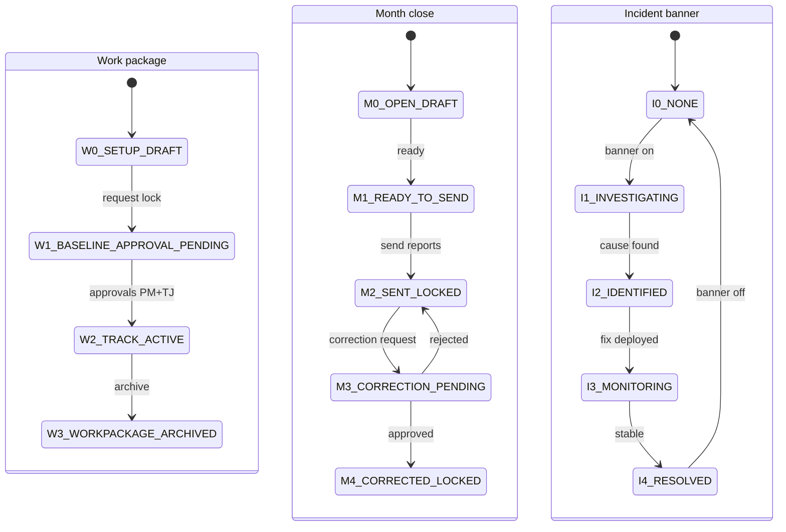

# Tilakoneet – Ennustus (MVP)

Päivitetty: 2026-01-02

Tässä dokumentissa on sovelluksen keskeiset **tilat (status)**, sallitut **siirtymät (transitions)** ja roolit.
Tarkoitus: helpottaa RBAC:tä, nappeja ja “lukituslogiikkaa”.

> Huom: tämä on “tuotteen tilamalli” (product state model), ei DevOps-julkaisuprosessi.

---

## 1) Company / Tenant onboarding (hallinnollinen polku)

### Tilat
| Koodi | Tila | Kuvaus |
|---|---|---|
| `C0_PROVISIONED` | Provisioned | Yhtiö (organization) + tenant luotu ja demoprojekti olemassa |
| `C1_ONBOARDING_LINK_SENT` | Link sent | ORG_ADMIN-kutsulinkki (Invite) luotu ja toimitettu |
| `C2_ONBOARDING_IN_PROGRESS` | In progress | Asiakas täyttää tiedot / kutsuu käyttäjät |
| `C3_READY` | Ready | Yritys valmis (minimiasetukset kunnossa) |

### Sallitut siirtymät
- `C0_PROVISIONED` → `C1_ONBOARDING_LINK_SENT` (**Myyjä** tai **Superadmin**)
- `C1_ONBOARDING_LINK_SENT` → `C2_ONBOARDING_IN_PROGRESS` (**Yritysadmin**)
- `C2_ONBOARDING_IN_PROGRESS` → `C3_READY` (**Yritysadmin**)
- `C3_READY` → `C2_ONBOARDING_IN_PROGRESS` (**Superadmin**) *(override/tuki)*

---

## 2) Project lifecycle (projekti)

### Tilat
| Koodi | Tila | Kuvaus |
|---|---|---|
| `P0_PROJECT_DRAFT` | Draft | Projekti on luotu, mutta ei vielä aktiivinen |
| `P1_PROJECT_ACTIVE` | Active | Projekti käytössä (tuotannon polku käytettävissä) |
| `P2_PROJECT_ARCHIVED` | Archived | Arkistoitu (vain katselu) |

### Sallitut siirtymät
- `P0_PROJECT_DRAFT` → `P1_PROJECT_ACTIVE` (**Yritysadmin** / Superadmin)
- `P1_PROJECT_ACTIVE` → `P2_PROJECT_ARCHIVED` (**Yritysadmin** / Superadmin)
- `P2_PROJECT_ARCHIVED` → `P1_PROJECT_ACTIVE` (**Superadmin**) *(valinnainen, jos sallitaan)*

---

## 3) Work package / Työpaketti (baseline + seuranta)

### Tilat
| Koodi | Tila | Kuvaus |
|---|---|---|
| `W0_SETUP_DRAFT` | Setup draft | Baselinea rakennetaan (muokattavissa) |
| `W1_BASELINE_APPROVAL_PENDING` | Approval pending | Baseline-lukitus odottaa hyväksyntöjä |
| `W2_TRACK_ACTIVE` | Track active | Baseline lukittu → viikkopäivitykset sallittu |
| `W3_WORKPACKAGE_ARCHIVED` | Archived | Ei uusia päivityksiä |

### Sallitut siirtymät
- `W0_SETUP_DRAFT` → `W1_BASELINE_APPROVAL_PENDING` (**PM/tuotanto**: “pyydä lukitus”)
- `W1_BASELINE_APPROVAL_PENDING` → `W2_TRACK_ACTIVE` (**PM hyväksyy 1/2** + **Tuotantojohtaja 2/2**)
- `W2_TRACK_ACTIVE` → `W3_WORKPACKAGE_ARCHIVED` (**Yritysadmin/Superadmin**) *(arkistointi)*

### Lukitussääntö (ydin)
- KPI/raportointi lasketaan “oikeaksi” vain kun työpaketti on `W2_TRACK_ACTIVE`.

---

## 4) Month close -sykli (per projekti + kuukausi)

### Tilat
| Koodi | Tila | Kuvaus |
|---|---|---|
| `M0_OPEN_DRAFT` | Open draft | Kuukausi auki: ennuste + % + ghost + memo muokattavissa |
| `M1_READY_TO_SEND` | Ready to send | Valinnainen: sisäinen “ok lähetettäväksi” |
| `M2_SENT_LOCKED` | Sent locked | Raportit lähetetty → kuukausi lukossa |
| `M3_CORRECTION_PENDING` | Correction pending | Korjauspyyntö hyväksynnässä |
| `M4_CORRECTED_LOCKED` | Corrected locked | Korjaus hyväksytty, uusi versio voimassa (lukossa) |

### Sallitut siirtymät
- `M0_OPEN_DRAFT` → `M1_READY_TO_SEND` (**Tuotantojohtaja/Yritysadmin**)
- `M1_READY_TO_SEND` → `M2_SENT_LOCKED` (**Tuotantojohtaja/Yritysadmin**: “lähetä raportit”)
- `M2_SENT_LOCKED` → `M3_CORRECTION_PENDING` (**Tuotantojohtaja**: “tee korjauspyyntö”)
- `M3_CORRECTION_PENDING` → `M4_CORRECTED_LOCKED` (**Yksikön johtaja**: “hyväksy”)
- `M3_CORRECTION_PENDING` → `M2_SENT_LOCKED` (**Yksikön johtaja**: “hylkää”)

### Lukitussääntö (ydin)
- Kun kuukausi on `M2_SENT_LOCKED` tai `M4_CORRECTED_LOCKED`, kaikki muutokset sallitaan vain korjauspolun kautta.

---

## 5) Incident banner (in-app) – tila (Support/Incident)

> Tiketti on ulkoinen, mutta banneri on asiakasviestintä sovelluksessa.  
> Bannerin status auttaa kertomaan “missä mennään”.

### Bannerin status (suositus)
| Koodi | Status | Milloin |
|---|---|---|
| `I0_NONE` | None | Ei banneria |
| `I1_INVESTIGATING` | Investigating | Tiedetään että on häiriö, syy selvityksessä |
| `I2_IDENTIFIED` | Identified | Syy löytynyt / korjaus työn alla |
| `I3_MONITORING` | Monitoring | Korjaus ajettu / mitigointi päällä, seurataan |
| `I4_RESOLVED` | Resolved | Häiriö ohi → banneri voidaan poistaa (siirtyy I0) |

### Sallitut siirtymät
- `I0_NONE` → `I1_INVESTIGATING` (Superadmin / Support)
- `I1_INVESTIGATING` → `I2_IDENTIFIED` (Superadmin / Support)
- `I2_IDENTIFIED` → `I3_MONITORING` (Superadmin / Support)
- `I3_MONITORING` → `I4_RESOLVED` (Superadmin / Support)
- `I4_RESOLVED` → `I0_NONE` (Superadmin / Support)

### Minimikentät bannerille
- `severity`: SEV1/SEV2/SEV3
- `status`: (Investigating/Identified/Monitoring/Resolved)
- `title`, `message`
- `affected_components`: login/import/reports/other
- `workaround` (optional)
- `next_update_at` (pakollinen SEV1:lle)

(Detaleihin: `docs/runbooks/incident.md`)

---

## 6) Mermaid-tilakaavio (Month + Work package + Incident)

---

## Implementation notes (tilakoneet → koodiksi)

Tämä osio kertoo, miten tilat kannattaa mallintaa niin, että:
- UI-napit voidaan johtaa tilasta
- backend voi tehdä yksiselitteiset validoinnit
- testit voivat tarkistaa invarianssit

### 1) Missä tilat sijaitsee?

**Suositus (MVP):**
- `company_onboarding_state` tenant-tasolla (C0–C3)
- `project_state` projektitasolla (P0–P2)
- `work_package_state` työpakettitasolla (W0–W3)
- `month_state` projektin kuukausitasolla (M0–M4)
- `incident_banner_state` globaalina (I0–I4)

### 2) Tilasiirtymät ovat “tapahtumia” (events)

Älä “muokkaa riviä ilman jälkeä”. Tee siirtymä aina tapahtumana, jossa on:
- `from_state`
- `to_state`
- `actor_user_id`
- `reason`
- `created_at`

Esim.:
- `work_package_state_events`
- `month_state_events`

### 3) Gate-funktiot (yhden totuuden lähde)

Suositus: kirjoita backendin (tai DB:n) apufunktiot:

- `can_edit_weekly(project_id, month, user_id)`  
- `can_send_reports(project_id, month, user_id)`  
- `can_request_month_correction(project_id, month, user_id)`  
- `can_approve_month_correction(project_id, month, user_id)`

UI voi kysyä nämä “capabilities”:
- `GET /api/me/capabilities?project_id=...&month=...`
ja näyttää napit sen mukaan.

### 4) Lukituksen pakotus

**Pakota lukitus backendissä ja/tai DB:ssä:**
- jos `month_state >= M2_SENT_LOCKED`:
  - estä `weekly_updates`, `ghosts`, `forecast` kirjoitukset
  - salli vain `corrections` workflow

Vastaavasti baseline:
- jos `work_package_state == W2_TRACK_ACTIVE`:
  - estä koostumuksen muokkaukset (members), paitsi “korjauspolun” kautta

### 5) Raporttilähetys atomisena operaationa

`send-reports` kannattaa toteuttaa “atomisena”:
1) validoi `month_state` (M0/M1)
2) generoi raportti snapshotista
3) tallenna report package (immutable)
4) lähetä emailit
5) aseta `month_state = M2_SENT_LOCKED`

Jos email epäonnistuu:
- päätä politiikka (suositus): **ei lukita**, ja merkitse “send failed” tikettiin/logiin.

### 6) Korjaus = uusi versio (append-only)

Kun korjaus hyväksytään:
- älä muokkaa vanhaa “lähetettyä” dataa
- luo uusi “correction version”, joka tulee “latest”-näkymiin
- arkistoi uusi report package

### 7) Incident banner tilakone (I0–I4)

Minimitilat:
- `I0_NONE`
- `I1_INVESTIGATING`
- `I2_IDENTIFIED`
- `I3_MONITORING`
- `I4_RESOLVED`

UI näyttää bannerin, jos tila != I0.  
Superadmin voi vaihtaa tilaa ja tekstiä.

### 8) Verify-skriptit (DB gate)

Lisää verify-skriptit, jotka tarkistavat:
- locked month → ei write-rivejä “väärällä tavalla”
- report_packages on immutable (ei UPDATE/DELETE)
- tenant_id filter exists kaikissa relevantissa tauluissa/views
- “latest” näkymät eivät tuplaa snapshotteja (import)

Nämä verify-skriptit ajetaan:
- CI integration tests
- staging deploy
- prod deploy (gate)

## Mitä muuttui
- Päivitetty päivämäärä 2026-01-02.
- Lisätty muutososiot dokumentin loppuun.
- Täsmennetty tenant-onboarding-tilojen C0/C1 merkitys nykyisen kutsulinkkimallin mukaiseksi (yhtiö+demo, invite).

## Miksi
- Päivämäärä pidetään linjassa päätöslokin kanssa.
- Dokumentaatiokäytäntö: muutokset kirjataan näkyvästi.

## Miten testataan (manuaali)
- Varmista, että päivämäärä vastaa päätöslokia.
- Avaa dokumentti ja varmista, että osiot ovat mukana.
- Tarkista, että C0/C1 kuvaukset vastaavat master- ja nappipolkujen myyjä-vaihetta.
