# Toimittajan polku (SDLC) – Ennustus (MVP)

Päivitetty: 2025-12-30

Tämä dokumentti kuvaa **toimittajan sisäisen kehitys- ja testipolun** (Software Delivery Lifecycle).
Tavoite: jokainen muutos kulkee saman “portitetun” reitin kautta, jotta tuotanto pysyy vakaana.

> Detaljit julkaisusta ja porteista: `docs/runbooks/release.md`  
> Incident-hotfix ja data-fix kytkeytyvät tähän samaan pipelineen.

---

## Ympäristöt

| Ympäristö | Tarkoitus | Kuka käyttää |
|---|---|---|
| **Dev** | kehitys paikallisesti / feature-branch | dev |
| **CI/Test** | automaattiset testit | pipeline |
| **Staging** | prod-kaltainen hyväksyntäympäristö (pakollinen) | dev + approver |
| **Prod** | tuotanto | asiakkaat |

---

## Testitasot (minimi)

1) **Unit** – laskentasäännöt, validoinnit, tilasiirtymät  
2) **Integration (DB)** – migraatiot, näkymät (views), invariants/verify  
3) **E2E** – UI-polut (admin + tuotanto + month close)

---

## Portit (Gates)

### Gate A – ennen mergeä
- PR vaatii:
  - unit ✅
  - integration (DB) ✅
  - e2e ✅
  - katselmointi (review) ✅

### Gate B – Staging → Prod
- Nimetty **approver** tekee Go/No-Go.
- Lisäksi aina:
  - staging DB backup
  - migrations + verify

### Gate C – Prod
- aina:
  - prod DB backup
  - migrations + verify (jos verify failaa → stop)
  - post-deploy smoke + monitorointi

---

## Hotfix-kaista (Incident)
- Samaa pipelinea, mutta nopeutettuna:
  - *ei* ohita stagingia
  - *ei* ohita DB backup + migrations/verify -portteja
  - approver vaaditaan

(Detaleihin: `docs/runbooks/incident.md` + `docs/runbooks/release.md`)

---

## Data-fix (korjausskriptit)
- Tuotannossa **ei manuaalista DB-editointia**.
- Korjaukset versionoiduilla skripteillä:
  - migrations/backfill/verify

(Detaleihin: `docs/runbooks/data-fix.md`)

---

## SDLC-kaavio

```mermaid
flowchart LR
  A["Backlog / Ticket"] --> B["Dev (feature branch)"]
  B --> C["PR + review"]
  C --> D["Unit tests"]
  D --> E["Integration tests (DB+migrations+views)"]
  E --> F["E2E tests (UI paths)"]
  F --> G["Deploy Staging"]
  G --> H["Staging DB backup"]
  H --> I["Run migrations + verify"]
  I --> J["Smoke/UAT"]
  J --> K["Approver Go/No-Go"]
  K --> L["Prod DB backup"]
  L --> M["Run migrations + verify (gate)"]
  M --> N["Deploy prod"]
  N --> O["Post-deploy smoke + monitor"]
```

